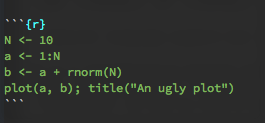

--- 
title: "Overview"
author: "Gonzalo Rivero"
date: "February, 10, 2016"
output:	html_document
---

**Why R?**

- Open source and extensible. It is also free of charge. More importantly, you (and the community)
  can inspect the code for any function.
- Very popular _programing language_ for statistics. "It promotes
  experimentation and exploration, which improves data analysis." Lots of
  libraries for all kinds of specialized tasks.
- Great for visualization. Excellent packages for graphics.
- Excellent documentation and online help.
- A very active and helpful community.

**What is R anyway?**

If you are coming from SAS or Stata, you are better of thinking about it as a programming language and not as a
statistical environment:
- Interpreted: allows direct executions of code, which makes it slower than
  compiled languages.
- Dynamically typed: Easy and less boiler plate, makes metaprogramming a lot easier. 
- Multi-paradigm. Although most users exploit object orientation.

The extension of the R files is usually `.R`

**RStudio**

R can be downloaded from the Comprehensive R Archive Network,
[CRAN](https//cran.r-project.org). But we will be using RStudio, a popular IDE.
It is possible to use R with other IDE and text editors:

- `emacs` through [ESS](http://ess.r-project.org/) (what I use).
- `vim` with the [Vim-R-Plugin](http://www.vim.org/scripts/script.php?script_id=2628).
- Sublime Text.

**A few useful resources**

There is a constantly growing collection of materials available offline and
online to learn R. The
[Journal of Statistical Software](http://www.jstatsoft.org/index) and the
[Use R!](http://www.springer.com/series/6991) series from Springer regularly
publish applications of R to different domains.

The [R Inferno](http://www.burns-stat.com/documents/books/the-r-inferno/) is a bit outdated but still contains a good collection of
trouble spots, oddities, traps, glitches in R. 

SAS users may find useful
[R for SAS and SPSS users](http://www.springer.com/us/book/9781461406846),
although I have never used it myself (I don't know SAS).

For the analysis of compley survey data, you may want to take a look to ["Complex
Surveys. A Guide to Analysis Using R"](http://r-survey.r-forge.r-project.org/svybook/). 

The official documentation in CRAN (The Comprehensive R Archive Network) is
simply excellent but it goes well beyond the scope of this class.

**Looking around**

RStudio offers four basic windows. 

- Console (R interpreter)
- Code, where we will write our code.
- History/Environment
- Plots/Packages/Help

**Getting help**

The documentation of R has a well-earned reputation of being excellent. It can
be accessed through the interpreter. For instance, if we wanted to get
information about what `lm` does, or what paramaters it takes or some examples
of usage, we would type:
```{r}
?lm
```

The R community is very helpful and active. If you ever get stuck in a problem, the best solution is to ask in 
[StackOverflow](http://stackoverflow.com/), a very large community of
programmers using the `#r` tag. 

For obvious reasons, the language is sometimes referred to as "Rstats" (social
media and search engines, anyone?).

**About this document**

I have prepared these materials using using
[Rmarkdown](http://rmarkdown.rstudio.com/), a format that makes it easy to
create dynamic documents. The text is written in markdown, the easiest possible
markup language ("easy-to-read, easy-to-write"): `_italic_`, `**bold**`,
... but it also allows to include chunks of executable R code. It simplifies
reproducibility and it is very easy to share.

For instance, 

<p align="center">

</p>

is rendered as:

```{r}
N <- 10
a <- 1:N
b <- a + rnorm(N)
plot(a, b); title("An ugly plot")
```

GitHub and `git` more generally deserve a class on its own, but here it will
only be used to host the code.
