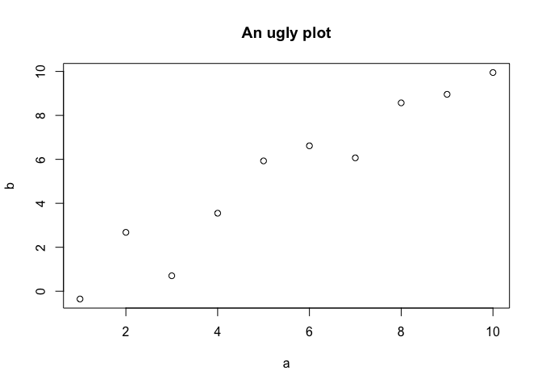
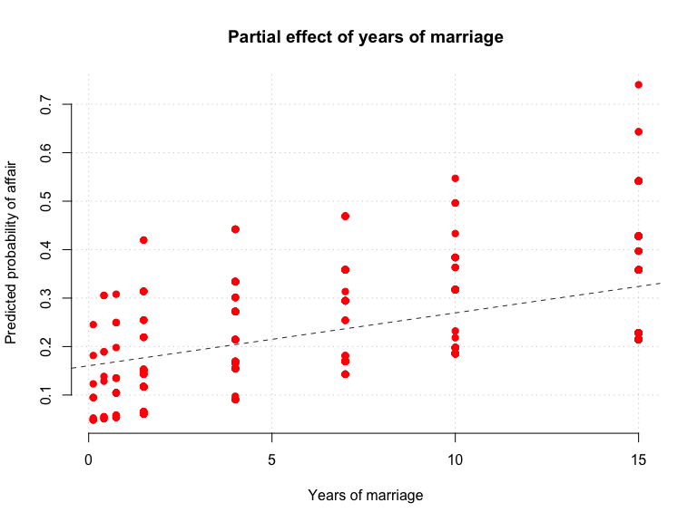
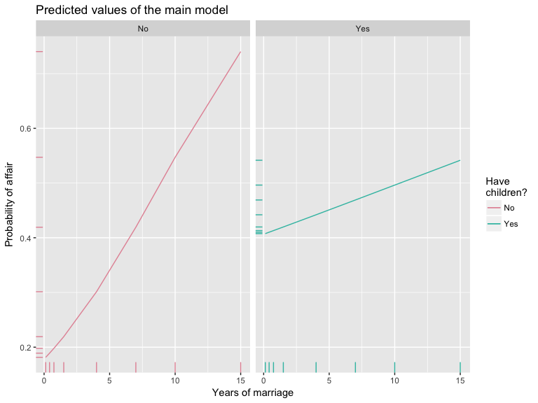

The graphical toolbox in R is particularly impressive. I very much like
the default plotting library that ships with R: it is clear, simple, and
you can build pretty much any figure you can imagine, because it allows
to add and manipulate every single element of the figure.

Let's take the model we built before with some minor changes:

    affairs <- read.csv("http://koaning.io/theme/data/affairs.csv")
    affairs$R <- affairs$nbaffairs > 0
    sample_model <- glm(R ~ ym*child + factor(religious), 
                        data=affairs, 
                        family=binomial)

and create an easy plot of the predictions:

    affairs$yhat <- predict(sample_model, newdata=affairs, type="response")
    plot(affairs$ym, affairs$yhat)

and with some effort we could customize the picture a bit:

    plot(affairs$ym, affairs$yhat, 
         col="red", 
         pch=19, 
         bty="n", 
         main="", xlab="", ylab="", 
         panel.first=grid())
    title(xlab="Years of marriage", 
          ylab="Predicted probability of affair", 
          main="Partial effect of years of marriage")
    abline(lm(affairs$yhat ~ affairs$ym), 
           lty=2, 
           col="gray20")
    legend(9.5, 0, "Best fit", col="gray20", lty=2, bty="n")

However, its flexibility comes at a cost, and figures usually require a
lot of work.

The `ggplot2`, which implements the "grammar of graphics" approach to
building data visualization, has rightfully gained a great deal of
popularity, and it is the library that we will use here.

    install.packages("ggplot2")

    ## Installing package into '/Users/gonzalorivero/Rlibs'
    ## (as 'lib' is unspecified)

    library(ggplot2)

Before going into details, let's start

    p <- ggplot(affairs, aes(x=ym, y=yhat))
    p + geom_point() + 
      labs(title="Partial effect of years of marriage", 
           x="Years of marriage", 
           y="Predicted probability of affair") +
      geom_smooth(method="lm", se=FALSE)

The advantages of `ggplot2` as, I hope, can be seen above are that 1) it
is much easier to create a publication-ready figure and 2) the syntax is
also cleaner. If nothing else, `ggplot2` offers "sensible" defaults for
plots but in exchange the approach to building plots is slightly
different from other languages ---although it is currently adopted in
many other tools.

The structure of a figure in `ggplot2` is simple. We first define the
data.frame that we will be using, the basic aesthetics for the figure
(which variables go to which axis, whether the the dataset is grouped).
We use the `ggplot` function for that. Then, we add the different layers
of the figure that correspond to the different elements of ghe graph.

For instance, to define a histogram to plot the distribution of our
predicted variable, all we need is one variable living in a dataset:

    p <- ggplot(affairs, aes(x=yhat))
    p + geom_histogram()

    ## `stat_bin()` using `bins = 30`. Pick better value with `binwidth`.

Getting the distribution of the predicted probability by whether the man
has kids is easy: we declare that data is grouped by `child` and, in
addition, that the bar corresponding to each of the values of `child`
will have a different color. In addition, we add labels and a title
(because we love good practices):

    p <- ggplot(affairs, aes(x=nbaffairs > 0, group=child, fill=child))
    p + geom_bar(position="dodge") +
        labs(title="Likelihood of affair by whether they had children",
             x="Had an affair?", y="Frequency")

The feature sold me to `ggplot2` is that makes it very easy to get
conditional plots. For instance, our theoretical model above posed an
interaction between years of marriage and whether the man had children.
This is, the expected number of affairs for a given time ellapsed in
marriage is expected to be different depending on whether the man has
children or not. Therefore, in the exploration of our data, we would
like to see the number of affairs by `ym` and by `children`. For
instance, we could look at:

    p <- ggplot(affairs, aes(x=nbaffairs > 0, group=child))
    p + geom_bar(position="dodge") +
        facet_grid(child ~ ym) +
        labs(title="Likelihood of affair by children", x="Any affair?", y="Frequency")

What we see in the representation above is a number of `facets`. The
upper section represents the distribution for the cases in which the man
didn't have children. The bottom section, the cases for which he did. In
each of the vertical cells we see different durations of marriage. We
see that men without children seem more likely have affairs right after
being married but then the difference between the `yes` and `no` bars
decrease over time after reaching a peak in around 1.5 years of
marriage. However, for men *with* children, the difference grows over
time.

We can now compare this result to what we estimated in the model above.
To do that, we will repeat the same process we did before. First we
create a fake data frame that captures the effect we are interested in,
and then we apply our model to the data:

    fake_data <- expand.grid(ym=sort(unique(affairs$ym)), 
                             child=c("no", "yes"), 
                             religious=1)

    fake_data$phat <- predict(sample_model, newdata=fake_data, type="response")
    fake_data

    ##        ym child religious  phat
    ## 1   0.125    no         1 0.181
    ## 2   0.417    no         1 0.189
    ## 3   0.750    no         1 0.198
    ## 4   1.500    no         1 0.219
    ## 5   4.000    no         1 0.301
    ## 6   7.000    no         1 0.419
    ## 7  10.000    no         1 0.547
    ## 8  15.000    no         1 0.740
    ## 9   0.125   yes         1 0.408
    ## 10  0.417   yes         1 0.410
    ## 11  0.750   yes         1 0.413
    ## 12  1.500   yes         1 0.420
    ## 13  4.000   yes         1 0.442
    ## 14  7.000   yes         1 0.469
    ## 15 10.000   yes         1 0.496
    ## 16 15.000   yes         1 0.542

First some housekeeping:

    library(scales)
    levels(fake_data$child) <- c("No", "Yes")
    cols <- colorspace:::rainbow_hcl(2)
    print(cols)

    ## [1] "#E495A5" "#39BEB1"

And now we plot things with some additional details to make it look
ready for a presentation:

    p <- ggplot(fake_data, aes(x=ym, y=phat, colour=child))
    pq <- p + geom_line() +
        geom_rug() +
        facet_wrap( ~ child) + 
        labs(title="Predicted values of the main model",
             x="Years of marriage",
             y="Probability of affair") + 
        scale_color_manual("Have\nchildren?",
                           values=c("No"=cols[1],
                                    "Yes"=cols[2]))
    print(pq)

How to save a figure? The easiest way is probably to use the `ggsave`
wrapper:

    ggsave("my-pretty-figure.png", pq)
