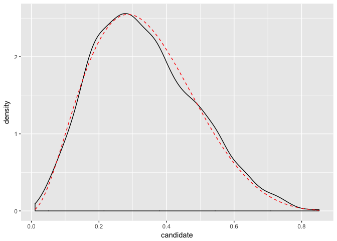

The very basics of programming
================
October 27, 2017

One of the very nice features of R when one comes from other statistical software like SAS or Stata is that it is very easy to program. And that is a really good thing, because the manipulation, analysis, and visualization of data is considerably easier when one can write small functions. In addition, because R is open-source, you can inspect what every function does, so it is useful to get a sense of the most basic elements of programming to be able to take advantage of that feature.

### Defining functions

Think about functions as a way of packing operations in one reusable expression. For instance, consider a trivial example in which we want to calculate a mean. Instead of doing `sum` over `length` in every situation, we could just pack those operations together and give them a name:

``` r
my_mean <- function(x) sum(x)/length(x)
my_mean(c(0, 1))
```

    ## [1] 0.5

To define a function, we use the keyword `function` followed by parenthesis and (optionally) the arguments that the function takes, and the expression that the function runs. We then assign this function to a name, in this case, `my_mean`.

See how typing `my_mean` allows you to see what you have just defined.

``` r
my_mean
```

    ## function(x) sum(x)/length(x)
    ## <environment: 0x7fd3e220a190>

The way we defined the function is perfectly valid but we could also be a bit more explicit by enclosing the statement in parenthesis and ensuring that it is returned.

``` r
my_mean <- function(x) {
  return(sum(x)/length(x))
}
```

Now that we have the fundamentals of how to define a function, let's take a look at control flow operations.

### Loops

`for` allows us to iterate and repeat an operation over a sequence. As you can imagine, we need to be explicit about two things: the sequence and the variable that will be taking values over that sequence.

``` r
for (i in 1:3) print(i)
```

    ## [1] 1
    ## [1] 2
    ## [1] 3

Let's see a less trivial example in which we want to calculate the sum of a vector:

``` r
myvector <- c(1, 2, 3, 4)
out <- 0
for (i in 1:length(myvector)) {
  out <- myvector[i] + out
}
out
```

    ## [1] 10

Here `out` will hold the result of progressively adding the values of `myvector`. Notice how `i` takes, in each iteration, a different value in the sequence between 1 and the length of `myvector` that we then use to retrieve the value in each position.

Depending on the context, it will probably make sense to wrap this operations in a function. At the end of the day, the only thing that will change in different calculations of a sum is the vector it operates over, so we can *parametrize* over that vector:

``` r
my_sum <- function(x) {
  out <- 0
  for (i in 1:length(x)) {
    out <- x[i] + out
  }
  return(out)
}
my_sum(c(1, 2, 3, 4))
```

    ## [1] 10

Another way to build loops is with the statement `while`. It will evaluate an expression until a condition is not met:

``` r
i <- 0
while (i < 3) {
  print(i)
  i <- i + 1
}
```

    ## [1] 0
    ## [1] 1
    ## [1] 2

The thing to notice is that how in each iteration of the loop, the value of `i` changes: when it takes the value 3, the condition `i < 3` evaluates to FALSE, and the loop stops --and therefore, 3 is not printed to the screen.

There are some cases in which the use of `which` is natural, like when we want to run algorithms until something converges. Take for instance the calculation of Newton-Raphson:

``` r
tol <- 0.01
x_last <- 10; diff <- 1
while (abs(diff) > tol) {
    x <- x_last - (x_last^2)/(2*x_last)
    diff <- (x - x_last)
    x_last <- x
    print(x)
}
```

    ## [1] 5
    ## [1] 2.5
    ## [1] 1.25
    ## [1] 0.625
    ## [1] 0.312
    ## [1] 0.156
    ## [1] 0.0781
    ## [1] 0.0391
    ## [1] 0.0195
    ## [1] 0.00977

However, `while` may end up producing infinite loops if one is not careful.

### Conditionals

As you can imagine, conditionals execute an action depending on the value (`TRUE` or `FALSE`) of another statement. In R, they use the follow syntax:

``` r
if (x > 0) {
  print("It's positive") 
} else if (x == 0) {
  print("It's neither positive nor negative")
} else {
  print("It's negative")
}
```

which we may wrap up in a function

``` r
my_sign <- function(x) {
  if (x > 0) {
    out <- "It's positive!"
  } else if (x == 0) {
    out <- "It's neither positive nor negative!"
  } else {
    out <- "It's negative!"
  }
  return(out)
}
```

and use it to illustrate what happens when you are not careful:\[^1\]

``` r
my_sign("A cow")
```

    ## [1] "It's positive!"

How to deal with the previous issue? By issuing an error:

``` r
my_sign <- function(x) {
  if (!is.numeric(x)) {
    stop("Input is not a number")
  }
  
  if (x > 0) {
    out <- "It's positive!"
  } else if (x == 0) {
    out <- "It's neither positive nor negative!"
  } else {
    out <- "It's negative!"
  }
  return(out)
}
```

Two things two notice here. First, that `!` is the negation operator (`TRUE == !FALSE`). Second, that `stop` interrupts the evaluation and produces an error, so the function never reaches the next conditional.

The if-else structure is the building block of a rejection sampling algorithm, so let's use to makes samples out of a *B**e**t**a*(3, 6).

``` r
R <- 10000
samples <- matrix(NA, nrow=R, ncol=2)

for(i in 1:R) {
  samples[i, 1] <- runif(1, 0, 1)
  U <- runif(1, 0, 1)
  if(dunif(samples[i, 1], 0, 1)*3*U <= dbeta(samples[i, 1], 3, 6)) {
    samples[i, 2] <- 1
  }
  else if(dunif(samples[i, 1],0, 1)*3*U > dbeta(samples[i, 1], 3, 6)) {
  samples[i, 2] <- 0
  }
}

samples <- data.frame(samples)
names(samples) <- c("candidate", "accept")
samples <- samples[samples$accept == 1,]

library(ggplot2)
p <- ggplot(samples, aes(x=candidate))
p + geom_density() + 
    stat_function(fun=dbeta, args=list(3, 6), colour="red", linetype=2)
```


